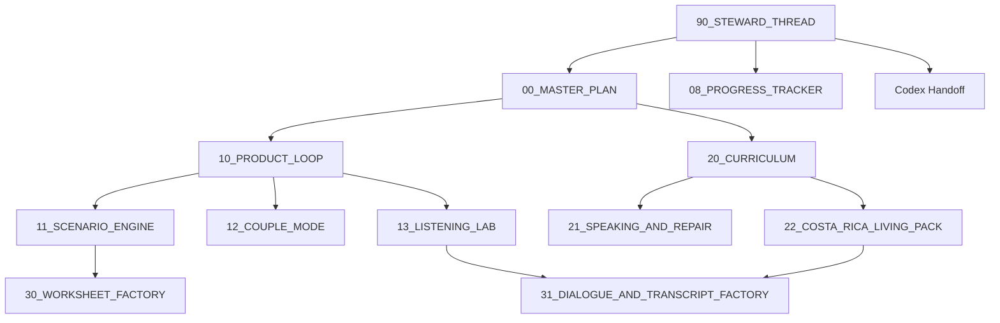

# ChatGPT Lane Map

This doc defines the recommended ChatGPT Project lane structure for this repo.

Use it to decide where a thread belongs, what it should own, and when it should hand off instead of expanding forever.

## Why Lanes Exist

Lanes are here to make this project survivable over long periods of work.

They help:

- separate strategy, weekly operations, product-loop design, curriculum design, and asset production
- reduce thread bloat before context limits become a problem
- keep scenario/content work from flooding product-loop threads
- keep implementation concerns from swallowing curriculum and coaching design threads
- make ChatGPT-to-Codex handoffs cleaner and smaller
- normalize thread rollover instead of treating it as failure

For this project specifically:

- ChatGPT is the planning, stewardship, curriculum, and content-control-tower layer
- Codex is the main implementation and verification engine
- the repo on `dev` is the code and product truth
- `90_STEWARD_THREAD` is the ChatGPT-side control tower

## Numbering Logic

- `00-08`: command lanes that steer the project
- `10-13`: product-loop lanes that shape the learner experience
- `20-22`: learning-system lanes that shape sequence and content direction
- `30-31`: asset-factory lanes that turn approved specs into reusable materials
- `90`: steward lane that keeps the whole ChatGPT side coherent

## Lane Interaction Diagram

## Quick Routing Guide

- If the question is "What should the next milestone be?" use `00_MASTER_PLAN`.
- If the question is "What should we do this week?" use `08_PROGRESS_TRACKER`.
- If the question is "How should the learner loop behave?" use `10_PRODUCT_LOOP`.
- If the question is "How should practice scenarios branch and progress?" use `11_SCENARIO_ENGINE`.
- If the question is "How should two partners practice together?" use `12_COUPLE_MODE`.
- If the question is "How should listening practice work at natural speed?" use `13_LISTENING_LAB`.
- If the question is "How should the whole learning system sequence?" use `20_CURRICULUM`.
- If the question is "How should speaking correction and repair drills work?" use `21_SPEAKING_AND_REPAIR`.
- If the question is "Which Costa Rica life domains matter most, and in what order?" use `22_COSTA_RICA_LIVING_PACK`.
- If the question is "Turn this approved spec into worksheets" use `30_WORKSHEET_FACTORY`.
- If the question is "Turn this approved spec into dialogues/transcripts" use `31_DIALOGUE_AND_TRANSCRIPT_FACTORY`.
- If the question is "Which thread should own this, and what is the current truth?" use `90_STEWARD_THREAD`.

## Recommended Lane Families

### Command Lane

#### `00_MASTER_PLAN`

- Purpose: own long-range sequencing, milestone order, and explicit `not now` decisions.
- Owns: 2-week, 6-week, quarter, and year-scale roadmap thinking; tradeoffs across product, curriculum, listening, and couple work; milestone ordering.
- Does not own: weekly task triage, detailed scenario specs, implementation execution, or raw asset production.
- Typical inputs: [CURRENT_STATE_CODEX_HANDOFF.md](/Users/guyharris/learn-to-live-in-costa-rica/docs/chatgpt/CURRENT_STATE_CODEX_HANDOFF.md), [DECISION_LOG.md](/Users/guyharris/learn-to-live-in-costa-rica/docs/chatgpt/DECISION_LOG.md), [ROADMAP_STATUS.md](/Users/guyharris/learn-to-live-in-costa-rica/docs/chatgpt/ROADMAP_STATUS.md), [APP_STATUS.md](/Users/guyharris/learn-to-live-in-costa-rica/docs/chatgpt/APP_STATUS.md), [CONTENT_STATUS.md](/Users/guyharris/learn-to-live-in-costa-rica/docs/chatgpt/CONTENT_STATUS.md), latest steward packet.
- Typical outputs: milestone order, explicit tradeoff calls, `not now` list, high-level workstream priorities, routing recommendations into specialist lanes.
- Hand off out of it when: strategy is clear enough that the next step is weekly execution planning or a specialist design thread.

#### `08_PROGRESS_TRACKER`

- Purpose: own the weekly operating read and next-7-day focus.
- Owns: wins, blockers, slippage, workstream balance, weekly priority correction, and near-term accountability.
- Does not own: long-range roadmap resets, detailed subsystem specs, or implementation execution.
- Typical inputs: latest Codex summary, [NEXT_ACTIONS.md](/Users/guyharris/learn-to-live-in-costa-rica/docs/chatgpt/NEXT_ACTIONS.md), [ROADMAP_STATUS.md](/Users/guyharris/learn-to-live-in-costa-rica/docs/chatgpt/ROADMAP_STATUS.md), [APP_STATUS.md](/Users/guyharris/learn-to-live-in-costa-rica/docs/chatgpt/APP_STATUS.md), [CONTENT_STATUS.md](/Users/guyharris/learn-to-live-in-costa-rica/docs/chatgpt/CONTENT_STATUS.md), blocker notes.
- Typical outputs: weekly status read, top 3 to 7 next tasks, one explicit defer, checkpoint questions, short owner split between ChatGPT and Codex.
- Hand off out of it when: the weekly plan is set or a deeper question clearly belongs in `00_MASTER_PLAN` or a specialist lane.

### Product Lane

#### `10_PRODUCT_LOOP`

- Purpose: define the core learner loop and product behavior around correction, retry, review, and progress.
- Owns: learner-flow rules, feedback loop behavior, acceptance criteria for the product loop, boundaries between text and speech paths, and what counts as a useful v1 experience.
- Does not own: long-range strategy, detailed scenario content packs, curriculum sequencing, or implementation tickets.
- Typical inputs: [APP_STATUS.md](/Users/guyharris/learn-to-live-in-costa-rica/docs/chatgpt/APP_STATUS.md), [CURRENT_STATE_CODEX_HANDOFF.md](/Users/guyharris/learn-to-live-in-costa-rica/docs/chatgpt/CURRENT_STATE_CODEX_HANDOFF.md), user feedback, session-pattern observations, latest steward direction.
- Typical outputs: product rules, acceptance criteria, v1 boundaries, design decisions ready for Codex, and cross-lane requests to scenario/listening/couple threads.
- Hand off out of it when: product rules are stable enough to implement or the next open question is narrower than the whole loop.

#### `11_SCENARIO_ENGINE`

- Purpose: design how practical Costa Rica scenarios behave inside the learner loop.
- Owns: scenario turn structure, branching logic, difficulty progression inside scenarios, scenario-state needs, and how scenario usefulness should be measured.
- Does not own: the full curriculum map, general app architecture, large transcript production, or raw implementation details.
- Typical inputs: [docs/product/scenarios.md](/Users/guyharris/learn-to-live-in-costa-rica/docs/product/scenarios.md), `data/scenarios/`, [CONTENT_STATUS.md](/Users/guyharris/learn-to-live-in-costa-rica/docs/chatgpt/CONTENT_STATUS.md), `10_PRODUCT_LOOP` decisions, living-pack priorities.
- Typical outputs: scenario engine specs, branching rules, scenario priority stacks, acceptance criteria for Codex, and briefs for asset-factory lanes.
- Hand off out of it when: the scenario system is defined enough for Codex implementation or content-factory production.

#### `12_COUPLE_MODE`

- Purpose: design how two household learners practice together without becoming a separate product fork.
- Owns: partner turn-taking, joint drills, partner roles, shared review rituals, and couple-specific progress patterns.
- Does not own: general curriculum sequencing, scenario branching outside partner needs, or install/distribution concerns.
- Typical inputs: `prompts/system/couple-mode.md`, [CONTENT_STATUS.md](/Users/guyharris/learn-to-live-in-costa-rica/docs/chatgpt/CONTENT_STATUS.md), [APP_STATUS.md](/Users/guyharris/learn-to-live-in-costa-rica/docs/chatgpt/APP_STATUS.md), `10_PRODUCT_LOOP` boundaries, user goals.
- Typical outputs: couple-mode product rules, in-app flow proposals, session patterns, asset briefs, and Codex-ready implementation packets.
- Hand off out of it when: the partner workflow is stable enough to build or the remaining questions belong in curriculum/speaking content.

#### `13_LISTENING_LAB`

- Purpose: design the listening progression for natural-speed Costa Rica Spanish.
- Owns: compare/dictation workflow, speed ladders, transcript usage, listening session structure, and what v1 listening progress should look like.
- Does not own: speech-recognition architecture, general scenario-engine rules, whole-curriculum sequencing, or transcript production at scale unless it is explicitly a factory request.
- Typical inputs: [CONTENT_STATUS.md](/Users/guyharris/learn-to-live-in-costa-rica/docs/chatgpt/CONTENT_STATUS.md), `worksheets/dictation/`, `data/transcripts/`, mistake-history patterns, `10_PRODUCT_LOOP` guardrails, living-pack priorities.
- Typical outputs: listening-lab spec, progression ladders, transcript briefs, success metrics, and Codex handoff packets for product support.
- Hand off out of it when: the listening workflow is clear enough for Codex or the next work is transcript/dialogue production.

### Learning-System Lane

#### `20_CURRICULUM`

- Purpose: own the overall learning-system sequence.
- Owns: progression across levels, weekly learning blocks, review cadence, sequencing between speaking/listening/scenarios, and curriculum backlog order.
- Does not own: app UX mechanics, detailed scenario branching rules, or weekly accountability.
- Typical inputs: [docs/curriculum/learning-philosophy.md](/Users/guyharris/learn-to-live-in-costa-rica/docs/curriculum/learning-philosophy.md), [docs/curriculum/level-framework.md](/Users/guyharris/learn-to-live-in-costa-rica/docs/curriculum/level-framework.md), [CONTENT_STATUS.md](/Users/guyharris/learn-to-live-in-costa-rica/docs/chatgpt/CONTENT_STATUS.md), speaking/listening lane outputs, move timeline priorities.
- Typical outputs: curriculum maps, unit priorities, review rhythm decisions, sequencing guidance, and briefs to speaking/living/factory lanes.
- Hand off out of it when: sequencing is set enough that the next work is specialist refinement or asset production.

#### `21_SPEAKING_AND_REPAIR`

- Purpose: design how speaking correction, repair, and mistake review should work.
- Owns: repair routines, error categories, retry styles, speaking-drill logic, and how recurring mistakes should drive future practice.
- Does not own: scenario branching, listening transcript packs, or platform implementation details.
- Typical inputs: `prompts/correction/`, speaking-drill assets, [CONTENT_STATUS.md](/Users/guyharris/learn-to-live-in-costa-rica/docs/chatgpt/CONTENT_STATUS.md), `10_PRODUCT_LOOP` decisions, Codex summaries of current error-tracking behavior.
- Typical outputs: mistake taxonomy guidance, speaking drill systems, repair progressions, review rules, worksheet briefs, and Codex-ready behavioral specs.
- Hand off out of it when: the repair model is stable enough to implement or needs to be translated into curriculum/assets.

#### `22_COSTA_RICA_LIVING_PACK`

- Purpose: keep the project anchored to real Costa Rica daily-life needs.
- Owns: scenario priority by move timeline, local living-domain packs, domain sequencing, and practical language bundles for housing, neighbors, healthcare, bank, utilities, and immigration.
- Does not own: generic grammar sequence, product mechanics, or transcript production at scale.
- Typical inputs: `data/scenarios/`, `data/vocab/`, [CONTENT_STATUS.md](/Users/guyharris/learn-to-live-in-costa-rica/docs/chatgpt/CONTENT_STATUS.md), user move-prep goals, curriculum priorities.
- Typical outputs: domain-priority lists, gap analyses, scenario-pack briefs, vocab-pack briefs, and handoffs into scenario-engine or factory lanes.
- Hand off out of it when: priorities are clear and the next work is scenario design, curriculum sequencing, or asset production.

### Asset Factory Lane

#### `30_WORKSHEET_FACTORY`

- Purpose: turn approved designs into worksheets, drills, quizzes, and printable review assets.
- Owns: production of worksheet assets once scope is already approved upstream.
- Does not own: net-new pedagogy, milestone sequencing, or product mechanics.
- Typical inputs: approved briefs from `20_CURRICULUM`, `21_SPEAKING_AND_REPAIR`, `13_LISTENING_LAB`, or `22_COSTA_RICA_LIVING_PACK`.
- Typical outputs: worksheet drafts, drill batches, printable review packs, reusable worksheet templates.
- Hand off out of it when: the asset batch is done or the spec is still too fuzzy and needs to go back upstream.

#### `31_DIALOGUE_AND_TRANSCRIPT_FACTORY`

- Purpose: turn approved listening/scenario briefs into dialogues, transcripts, and transcript metadata.
- Owns: dialogue production, transcript production, formatting consistency, and variant passes once the brief is locked.
- Does not own: listening-lab system design, scenario-engine rules, or implementation decisions.
- Typical inputs: approved briefs from `11_SCENARIO_ENGINE`, `13_LISTENING_LAB`, or `22_COSTA_RICA_LIVING_PACK`.
- Typical outputs: dialogue sets, transcript packs, transcript metadata, and clean asset bundles for repo ingestion.
- Hand off out of it when: the asset batch is complete or the brief needs to be tightened by the owning lane.

### Steward Lane

#### `90_STEWARD_THREAD`

- Purpose: act as the ChatGPT-side control tower.
- Owns: current-truth refreshes, lane routing, rollover timing, cross-lane conflict resolution, milestone framing, and quality control for ChatGPT-to-Codex handoffs.
- Does not own: doing all specialist work itself, carrying every thread forever, or replacing Codex as the implementation engine.
- Typical inputs: repo truth on `dev`, [CURRENT_STATE_CODEX_HANDOFF.md](/Users/guyharris/learn-to-live-in-costa-rica/docs/chatgpt/CURRENT_STATE_CODEX_HANDOFF.md), [DECISION_LOG.md](/Users/guyharris/learn-to-live-in-costa-rica/docs/chatgpt/DECISION_LOG.md), `00_MASTER_PLAN`, `08_PROGRESS_TRACKER`, specialist lane packets, and Codex summaries.
- Typical outputs: milestone framing, lane recommendations, consolidated handoff packets, refreshed current-truth summaries, and successor-thread start packets.
- Hand off out of it when: a milestone boundary, context reset, or ownership shift makes a new steward thread safer than continuing inline.

## Source-Of-Truth Order

Use this order when ChatGPT threads disagree with each other:

1. The latest user instruction in the live thread.
2. The current repo state on `dev`, including real workspace changes.
3. [AGENTS.md](/Users/guyharris/learn-to-live-in-costa-rica/AGENTS.md) and the repo stewardship rules under [docs/stewardship](/Users/guyharris/learn-to-live-in-costa-rica/docs/stewardship).
4. [CURRENT_STATE_CODEX_HANDOFF.md](/Users/guyharris/learn-to-live-in-costa-rica/docs/chatgpt/CURRENT_STATE_CODEX_HANDOFF.md) as the standing repo-to-ChatGPT state summary.
5. The latest validated `90_STEWARD_THREAD` summary or handoff packet.
6. The latest `00_MASTER_PLAN` milestone order and explicit `not now` list.
7. The latest `08_PROGRESS_TRACKER` weekly state and next-7-day plan.
8. The latest specialist owning-thread output for the narrow topic.
9. Uploaded source material or notes that have not yet been normalized into repo docs.

Working rules:

- If thread memory and repo files disagree, repo files win.
- If a specialist lane conflicts with `00_MASTER_PLAN`, the steward thread resolves it before more work proceeds.
- If `08_PROGRESS_TRACKER` asks for something that violates a locked `not now` decision, `00_MASTER_PLAN` wins until that decision is reopened.
- If private learner context changes the recommendation, keep the private data in local-only uploads, but still route the public operating truth through repo-safe docs.

## Lean Version

If you want fewer active threads, run this smaller system:

- `90_STEWARD_THREAD`
- `00_MASTER_PLAN`
- `08_PROGRESS_TRACKER`
- `10_PRODUCT_LOOP`
- `20_CURRICULUM`

Then open specialist lanes only when one area becomes active enough to justify its own thread:

- open `11_SCENARIO_ENGINE` when scenario mechanics need focused design
- open `12_COUPLE_MODE` when partner workflow becomes the main active workstream
- open `13_LISTENING_LAB` when listening progression becomes active work, not just a note in the roadmap
- open asset-factory lanes only after specs are already approved upstream

## Practical Defaults

- Keep only 1 to 3 specialist lanes active at the same time.
- Do not use asset-factory lanes to invent scope.
- Do not let `90_STEWARD_THREAD` turn into the place where all substantive work happens.
- Roll over a thread before its recap burden becomes worse than starting fresh.
- Every meaningful cross-lane or ChatGPT-to-Codex transfer should use a packet.
